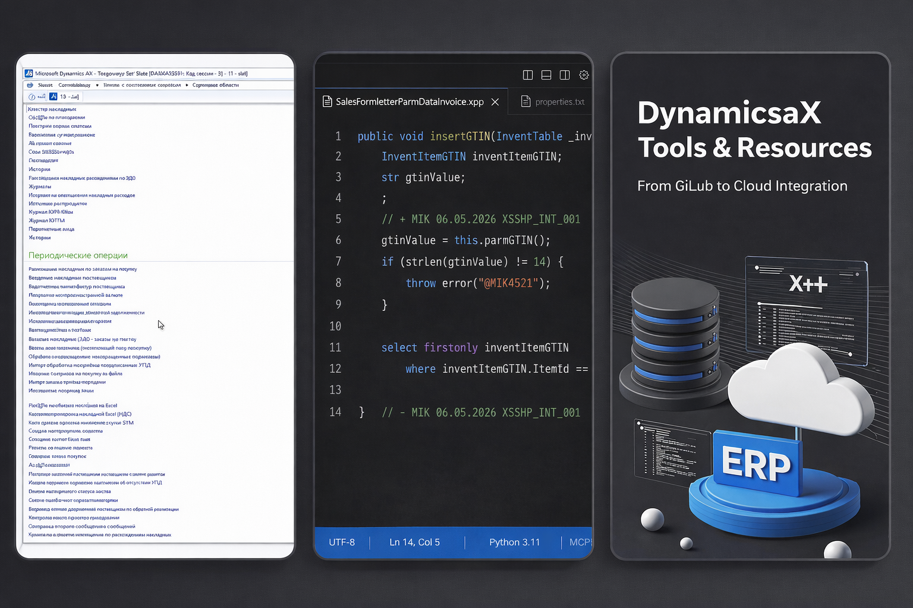

# Dynamics AX X++ Development Assistant


<!-- MOCKUPS:START -->

<!-- MOCKUPS:END -->

Инструментарий для **Microsoft Dynamics AX 2012**: вынос X++ из AOT в IDE, быстрый анализ больших CUS-экспортов, безопасный рефакторинг и сборка обратно в XPO для импорта.

**Цель:** сократить время на разбор чужого/наследованного кода, точечные правки и roundtrip «правка → `_WR.xpo` → AOT» без ручного копирования в MorphX.

---

## Зачем это AX-разработчику

| Боль в AX | Как решает репозиторий |
|-----------|-------------------------|
| Огромный CUS-экспорт, долго искать класс/метод | SQLite-индекс + полнотекстовый поиск + точечное извлечение одного объекта |
| Правки только в AOT — нет diff, нет AI-помощника | XPO → `parserXPO/*.xpp` → правки в Cursor/VS Code → `*_WR.xpo` |
| Страх сломать чужой код при доработке | Правила модификаций: старый код в `/* */`, маркеры `// +` / `// -`, проектные комментарии |
| Рефакторинг «на глаз» | Агент **xpp-review**, поэтапный пайплайн `/ax-phased-dev`, нормализация отступов |
| Забытый контекст прошлых задач | LightRAG (`@lightrag ? …`) + папка `Projects/` |

---

## Быстрый старт (типовой цикл)

```text
1. CUS-экспорт (справочник слоя)      →  AOT_cus/PrivateProject_CUS_Layer_Export.xpo
2. Индекс CUS (один раз / после обновления) →  /xpo-index-cus  (или python indexXPO_cus/xpo_indexer_sqlite.py)
3. Проектный XPO из AX                →  XPO/SharedProject_<ProjectId>.xpo
4. Извлечение объектов                →  /xpo-parse  или MCP get_element_code / parse_object_from_index
5. Правки X++                         →  parserXPO/ или parserXPO_Private/
6. Сборка для импорта в AOT           →  /xpo-roundtrip  →  XPO/<project>_WR.xpo
```

**Два каталога XPO:** `AOT_cus/` — полный CUS для поиска и точечной выгрузки; `XPO/` — рабочие проектные экспорты для writer и импорта в AX.

**Не редактируйте исходный `.xpo` вручную** — только `.xpp` в `parserXPO*`. Writer создаёт `_WR.xpo` рядом с исходником (cp1251, как у экспорта AX).

Подробнее про команды Cursor: [`develop.md`](develop.md).

---

## Ускорение анализа кода

### 1. Индекс CUS-слоя

Полный CUS в `AOT_cus/PrivateProject_CUS_Layer_Export.xpo` не парсят целиком без нужды. Сначала индекс:

```bash
# по умолчанию — AOT_cus/PrivateProject_CUS_Layer_Export.xpo
python indexXPO_cus/xpo_indexer_sqlite.py

# проверка актуальности индекса
python indexXPO_cus/check_xpo_index_health.py
# или slash-команда /xpo-index-check
```

БД `indexXPO_cus/xpo_index.db`: элементы, методы, байтовые позиции в файле, FTS5-поиск. MCP-сервер и `parse_object_from_index` читают **тот же** CUS из `AOT_cus/`.

### 2. Точечное извлечение

```bash
# один объект из большого XPO (через индекс)
python xpo_parser.py   # parse_object_from_index(...) из кода / MCP

# весь небольшой проектный XPO
python xpo_parser.py XPO/MyProject.xpo
python xpo_parser.py XPO/MyProject.xpo --force --no-input
```

### 3. MCP-сервер (поиск и выгрузка в parserXPO)

```bash
python mcp_server/server.py
```

| Инструмент | Для чего |
|------------|----------|
| `fulltext_search` | Найти строку/идентификатор по всему CUS |
| `get_element_code` / `get_method_code` | Вытащить класс/таблицу/метод в `parserXPO` |
| `search_labels_in_code` / `find_label_usage` | Расшифровка `@MIK…` / `@GMS…` / `@KOR…` / `@SYS…` через ALD |
| `replace_labels_in_parser` | Подставить расшифровки меток в `.xpp` (comments / inline) |
| `integrate_search_results` | Пакетно материализовать результаты поиска |

Документация: [`mcp_server/README.md`](mcp_server/README.md).

### 4. Исследование без правок кода

Скилл **`ax-investigation-pipeline`** (в чате: «/ax-investigation» или «исследуй по investigation pipeline»):

- разбор XPO + цепочки `extends`, метки ALD, родительские классы;
- добор контекста через LightRAG и CUS MCP;
- результат в `investigationTask.md` — карта для постановки задачи.

Используйте **до** написания кода: варианты решения, список затронутых AOT-объектов, риски.

### 5. База знаний LightRAG

В чате Cursor:

- `@lightrag ? <запрос>` — поиск по прошлым решениям, инцидентам, постановкам;
- `@lightrag + <текст>` — сохранить вывод сессии для следующих задач.

---

## Быстрая модификация X++

### Рабочие каталоги

| Каталог | Назначение |
|---------|------------|
| `parserXPO/` | Основной слой правок (проектные XPO, объекты из CUS) |
| `parserXPO_Private/` | Изолированные выгрузки (родители классов, разведка) |
| `XPO/` | Исходные экспорты AX (**не** править руками) |

Структура объекта:

```text
parserXPO/<AOT-каталог>/<ElementName>/   # Tables, Classes, Forms, Jobs, …
├── properties.txt
├── classDeclaration.xpp                   # для классов
└── <MethodName>.xpp
```

### Стандарты модификаций (обязательно)

Перед любой правкой `.xpp` — `.cursor/rules/comment_rules.mdc` и `commentmeta.json` (`developer`, `project`; **дата — сегодня**).

- одна строка: `код(); // developer DD.MM.YYYY project`
- блок: `// + developer …` … `// - developer …`
- удаление = комментарий `/* … */`, не вырезание

Текущий проект в комментариях: см. `commentmeta.json` → `project`.

### Поэтапная разработка

**`/ax-phased-dev`** — реализация по постановке из `Projects/<Project>/Documentation/`:

- фаза 0: индекс, план, scope **без** правок;
- фазы 1…N: правки порциями, после каждой — **xpp-review**;
- `_WR.xpo` — **только** по явной команде (`/xpo-roundtrip`).

Шаблон вызова: [`.cursor/commands/ax-phased-dev.md`](.cursor/commands/ax-phased-dev.md).

---

## Рефакторинг и качество

| Действие | Инструмент |
|----------|------------|
| Выравнивание отступов после парсинга | `python UtilsParserWriter/normalize_xpp_indent.py [parserXPO/SubFolder]` |
| Исправление кракозябр cp1251 ↔ UTF-8 | `python UtilsParserWriter/fix_mojibake.py` |
| Ревью X++ (компиляция, транзакции, AX-паттерны) | агент **xpp-review** / субагент в `/ax-phased-dev` |
| Инкрементальная сборка (только изменённые методы) | `python xpo_writer.py XPO/<file>.xpo` |
| Принудительная перезапись всех методов | `python xpo_writer.py … --force` |

Writer проверяет структуру XPO: заголовок, `***Element: END`, баланс `SOURCE`/`ENDSOURCE`.

---

## Cursor: команды, скилы, агенты

| Тип | Примеры | Назначение |
|-----|---------|------------|
| **Commands** `/…` | `xpo-parse`, `xpo-write`, `xpo-roundtrip`, `xpo-index-cus`, `xpo-index-check`, `xpo-delete`, `ax-phased-dev` | Одно действие одной командой |
| **Skills** | `dynamics-ax-xpo-roundtrip`, `ax-phased-dev-pipeline`, `ax-investigation-pipeline`, `lightrag-chatops`, `lightrag-research-loop`, `lightrag-ingestion-operator` | Правила пайплайна для агента |
| **Agents** | `xpo-tools`, `xpp-review` | Узкие роли: только скрипты или только ревью |

Рекомендуемый порядок для новой задачи:

```text
/xpo-index-check  →  investigation pipeline (если неясна архитектура)
→  /xpo-parse (проектный XPO) или MCP (объекты из CUS)
→  правки .xpp  →  /xpo-roundtrip (writer по XPO/SharedProject_….xpo)
```

---

## Сборка и импорт в Dynamics AX

Writer работает с **проектным** XPO из `XPO/`, не с полным CUS в `AOT_cus/`:

1. `python xpo_writer.py XPO/SharedProject_<ProjectId>.xpo`
2. В AX: **Tools → Development tools → Import** → `SharedProject_<ProjectId>_WR.xpo`
3. Проверить слой (CUS/USr), конфликты, **Compile** затронутых объектов
4. Прогнать сценарий из постановки (форма, job, интеграционное сообщение)

Файлы `*_WR.xpo` не используют как единственный источник для следующего парсинга — исходник остаётся базовым `.xpo` в `XPO/`.

---

## Структура репозитория

```text
DynamicsAX/
├── parserXPO/                 # Рабочий X++ (UTF-8)
├── parserXPO_Private/         # Точечные выгрузки / разведка
├── XPO/                       # Экспорты из AX (cp1251)
├── AOT_cus/                   # CUS-экспорт, ALD-метки (*.ald)
├── indexXPO_cus/              # SQLite-индекс, check_xpo_index_health.py
├── mcp_server/                # MCP для поиска и выгрузки (CUS → AOT_cus/)
├── Projects/                  # Постановки, XML, документация по задачам
├── .cursor/                   # commands, skills, agents, rules
├── xpo_parser.py              # XPO → parserXPO
├── xpo_writer.py              # parserXPO → *_WR.xpo
├── UtilsParserWriter/         # normalize_xpp_indent, fix_mojibake
├── utils/xpo_utils.py         # Общие функции парсера
├── commentmeta.json           # developer, project для комментариев
└── develop.md                 # Памятка по Cursor в этом проекте
```

---

## Справочник скриптов

| Скрипт | Назначение |
|--------|------------|
| `xpo_parser.py` | Парсинг XPO → `parserXPO/` (CLS, TAB, FRM, JOB и др.) |
| `xpo_writer.py` | Обратная запись изменённых `.xpp` → `<stem>_WR.xpo` |
| `indexXPO_cus/xpo_indexer_sqlite.py` | Построение/обновление FTS-индекса CUS |
| `indexXPO_cus/check_xpo_index_health.py` | Health-check индекса перед MCP/поиском |
| `xpo_delete.py` | Очистка каталогов `parserXPO/` и `XPO/` (`--yes`) |
| `UtilsParserWriter/normalize_xpp_indent.py` | Нормализация отступов в `.xpp` |
| `UtilsParserWriter/fix_mojibake.py` | Починка кодировки |
| `context7/__main__.py` | Контекстная документация для LLM |
| `mcp_server/server.py` | MCP-сервер |

Флаги CI/агентов: `--no-input`, `CI=1`, `XPO_NO_INPUT=1` — без интерактивных диалогов.

---

## Папка Projects/

`Projects/<ProjectName>/` — всё по конкретной задаче AX:

- **Documentation/** — ТЗ, ТС, todoList, версионные логи
- **XML/** — примеры сообщений интеграций
- артефакты анализа, планы тестов

Текущий `project` для комментариев в X++: поле `project` в `commentmeta.json`.

---

## Зависимости

```bash
# рекомендуется venv — см. SETUP.md
.\venv\Scripts\Activate.ps1
pip install -r requirements.txt
# MCP отдельно: pip install -r mcp_server/requirements.txt
```

- Python **3.11+**
- MCP, SQLite3 (встроенный); MCP в Cursor — через `.cursor/mcp.json` и `venv`
- Конфигурация: `pyproject.toml`, `requirements.txt`, [`SETUP.md`](SETUP.md)

---

## Важные ограничения

1. **Контекст перед правкой** — прочитайте `classDeclaration`, родителя `extends`, связанные таблицы/формы.
2. **Метки** — `@MIK4140` и т.п. расшифровывайте через MCP или `AOT_cus/*.ald`.
3. **Безопасность** — оригинальный XPO не перезаписывается; только `_WR.xpo`.
4. **CUS целиком** — не парсить без индекса/MCP; извлекать нужные объекты точечно.
5. **Кодировка** — `parserXPO` в UTF-8; импорт в AX через writer в cp1251 исходника.
