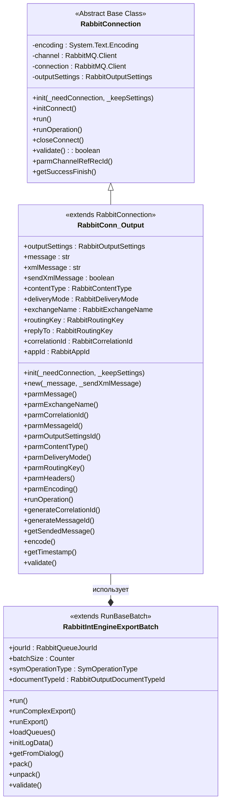
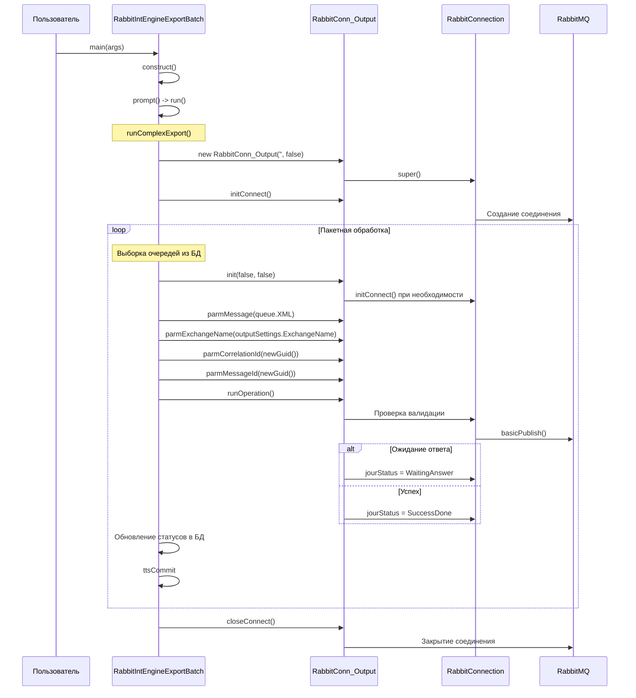
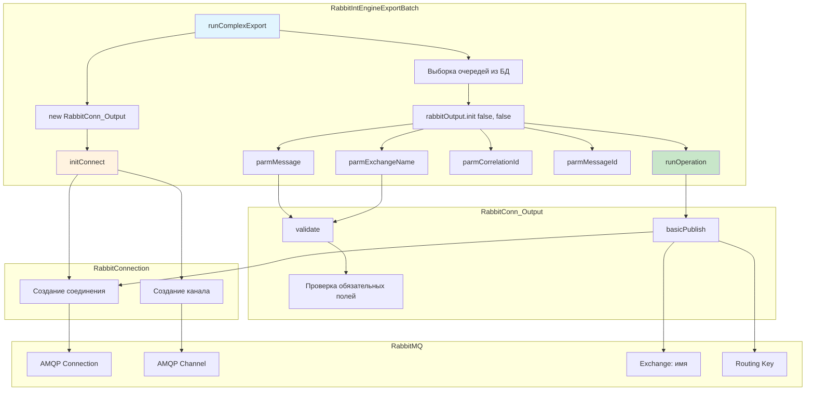

# RabbitMQ Integration in Microsoft Dynamics AX

Документация по классам интеграции с RabbitMQ, извлечённым из XPO файла.

## Иерархия классов



---

## 1. RabbitConnection (Базовый класс)

**Размер:** ~5,000 символов  
**Методов:** 10

### Описание
Абстрактный базовый класс для всех RabbitMQ соединений. Содержит общую логику подключения, управления каналом и отправки сообщений.

### Поля класса
```xpp
class RabbitConnection
{
    System.Text.Encoding    encoding;
    RabbitMQ.Client         channel;
    RabbitMQ.Client         connection;
    RabbitOutputSettings    outputSettings;
}
```

### Методы

| Метод | Назначение |
|-------|------------|
| `init()` | Инициализация соединения |
| `initConnect()` | Установка соединения с RabbitMQ |
| `run()` | Основной метод выполнения |
| `runOperation()` | Выполнение операции (отправка/получение) |
| `closeConnect()` | Закрытие соединения |
| `validate()` | Валидация параметров |
| `parmChannelRefRecId()` | Получение/установка RecId канала |
| `getSuccessFinish()` | Проверка успешного завершения |

---

## 2. RabbitConn_Output (Класс отправки сообщений)

**Размер:** ~15,090 символов  
**Методов:** 22

### Описание
Класс для отправки исходящих сообщений в RabbitMQ. Наследуется от `RabbitConnection` и добавляет специфичные для вывода параметры.

### Поля класса
```xpp
class RabbitConn_Output extends RabbitConnection
{
    RabbitOutputSettings    outputSettings;
    str                     message;
    str                     xmlMessage;
    boolean                 sendXmlMessage;
    
    RabbitContentType       contentType;
    RabbitDeliveryMode      deliveryMode;
    RabbitExchangeName      exchangeName;
    RabbitRoutingKey        routingKey;
    RabbitRoutingKey        replyTo;
    RabbitCorrelationId     correlationId;
    RabbitAppId             appId;
}
```

### Ключевые методы

#### `init(_needConnection, _keepSettings)`
```xpp
void init(
    boolean _needConnection = true,
    boolean _keepSettings   = true)
```
Инициализация объекта вывода. Логика:
1. Если `_needConnection = false` и есть `multiConnect`, используется `multiConnect`
2. Если `_needConnection = true`, вызывается `initConnect()`
3. Загружаются `outputSettings`

#### `new(_message, _sendXmlMessage)`
```xpp
void new(str _message = "", boolean _sendXmlMessage = true)
```
Конструктор. Устанавливает сообщение и флаг отправки XML.

#### `parmMessage(_message)`
```xpp
public str parmMessage(str _message = message)
```
Установка текста сообщения.

#### `parmExchangeName(_exchangeName)`
```xpp
public RabbitExchangeName parmExchangeName(
    RabbitExchangeName _exchangeName = exchangeName)
```
Установка имени exchange.

#### `runOperation()`
```xpp
void runOperation()
```
Выполнение операции отправки:
1. Установка `deliveryMode` и `contentType`
2. Кодирование сообщения в UTF-8
3. Установка заголовков и свойств
4. Публикация сообщения в RabbitMQ

#### `generateCorrelationId()`
```xpp
public RabbitCorrelationId generateCorrelationId()
```
Генерация уникального ID корреляции (`newGuid()`).

#### `generateMessageId()`
```xpp
public RabbitMessageId generateMessageId()
```
Генерация уникального ID сообщения (`newGuid()`).

#### `validate()`
```xpp
boolean validate()
```
Валидация обязательных полей:
- `contentType` — тип контента
- `deliveryMode` — режим доставки
- `exchangeName` — имя exchange

---

## 3. RabbitIntEngineExportBatch (Пакетный обработчик)

**Размер:** ~40,376 символов  
**Методов:** 24

### Описание
Основной класс для пакетной отправки сообщений в RabbitMQ. Наследуется от `RunBaseBatch` и обеспечивает пакетную обработку очередей.

### Поля класса
```xpp
class RabbitIntEngineExportBatch extends RunBaseBatch
{
    RabbitQueueJourId       jourId;
    container               logErrorCon;
    integer                 currentInfoLine;
    
    DialogField             dlgBatchSize;
    DialogField             dlgSymOperType;
    DialogField             dlgDocumentTypeId;
    
    Counter                 batchSize;
    SymOperationType        symOperationType;
    RabbitOutputDocumentTypeId documentTypeId;
}
```

### Ключевые методы

#### `run()`
```xpp
public void run()
```
Запуск обработки:
1. Инициализация логов (`initLogData()`)
2. Вызов `runComplexExport()` или `runExport()`
3. Обработка deadlock с повторными попытками

#### `runComplexExport()` (рекомендуемый)
```xpp
protected void runComplexExport()
```
Основной метод экспорта с поддержкой:
- Пакетной обработки (`batchSize`)
- Фильтрации по типу документа (`documentTypeId`)
- Фильтрации по операции (`symOperationType`)
- Расширенного логирования
- Повторных попыток при ошибках

#### `runExport()` (устаревший)
```xpp
protected void runExport()
```
Устаревший метод экспорта. Рекомендуется использовать `runComplexExport()`.

#### `loadQueues()`
```xpp
private void loadQueues()
```
Загрузка входящих очередей и их обработка.

---

## Диаграмма вызовов: Основной сценарий



---

## Детальный анализ: Цепочка вызовов init()

### Исходный код из `runComplexExport()`

```xpp
rabbitOutput = new RabbitConn_Output('', false);
rabbitOutput.initConnect();

while select forUpdate queue ...
{
    rabbitOutput.parmOutputSettingsId(outputSettings.Id);
    rabbitOutput.init(false, false);  // <-- Ключевой вызов
    rabbitOutput.parmMessage(queue.XML);
    rabbitOutput.parmExchangeName(outputSettings.ExchangeName);
    rabbitOutput.parmCorrelationId(newGuid());
    rabbitOutput.parmMessageId(newGuid());
    rabbitOutput.runOperation();
    
    // Обновление статусов в транзакции
    ttsBegin;
    jour.jourStatus = ...;
    jour.update();
    queue.QueueStatus = RabbitQueueStatus::Done;
    queue.update();
    ttsCommit;
}
```

### Пояснение параметров `init(false, false)`

| Параметр | Значение | Назначение |
|----------|----------|------------|
| `_needConnection = false` | Не устанавливать соединение | Соединение уже создано в `initConnect()` |
| `_keepSettings = false` | Не сохранять настройки | Позволяет переключаться между настройками |

### Внутренняя логика `init()`

```xpp
void init(boolean _needConnection = true, boolean _keepSettings = true)
{
    _needConnection = !_needConnection && multiConnect 
        ? multiConnect 
        : _needConnection;
    
    if (_needConnection)
    {
        // Вызов initConnect() если нужно соединение
        if (!outputSettings.RecId)
        {
            // Загрузка настроек
        }
    }
}
```

---

## Диаграмма зависимостей



---

## Таблица соответствия полей

| Поле в X++ | Тип | Описание |
|------------|-----|----------|
| `outputSettings` | RabbitOutputSettings | Настройки подключения |
| `exchangeName` | RabbitExchangeName | Имя RabbitMQ Exchange |
| `routingKey` | RabbitRoutingKey | Ключ маршрутизации |
| `contentType` | RabbitContentType | Тип контента (application/json, text/xml) |
| `deliveryMode` | RabbitDeliveryMode | Режим доставки (1 - непостоянный, 2 - постоянный) |
| `correlationId` | RabbitCorrelationId | ID для связи запроса и ответа |
| `messageId` | RabbitMessageId | Уникальный ID сообщения |

---

## Обработка ошибок

### Типы исключений в `runComplexExport()`

```xpp
try
{
    // Основной код
}
catch (Exception::Deadlock)
{
    // Повторная попытка при deadlock
    retry;
}
catch (Exception::CLRError)
{
    // Ошибки .NET (RabbitMQ Client)
    netExcepn = CLRInterop::getLastException();
}
catch
{
    // Повтор при timeout для определённого типа документа
    if (documentTypeId == typeId)
    {
        sleep(delay * 1000);
        retry;
    }
}
```

### Параметры повторных попыток

| Параметр | Источник | Описание |
|----------|----------|----------|
| `RabbitConnectTimeoutErrorRepeat` | RabbitParameters | Количество повторов |
| `RabbitConnectTimeoutErrorDelay` | RabbitParameters | Задержка между повторами (сек) |
| `RabbitConnectTimeoutErrorResize` | RabbitParameters | Уменьшение batch size |
| `RabbitConnectTimeoutErrorTypeId` | RabbitParameters | Тип документа для повторов |

---

## Файлы проекта

| Файл | Назначение |
|------|------------|
| `templates/PrivateProject_CUS_Layer_Export.xpo` | Исходный XPO файл (131 МБ) |
| `full_analysis.py` | Скрипт извлечения классов |
| `RabbitConnection.md` | Эта документация |